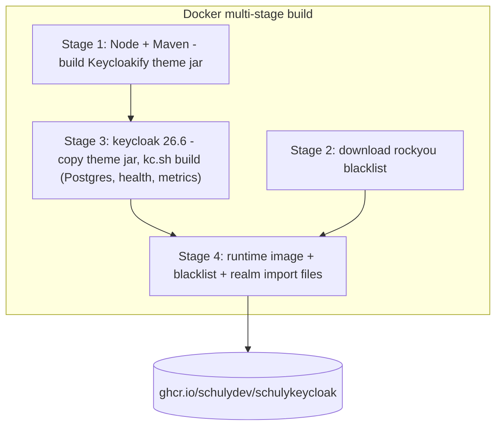
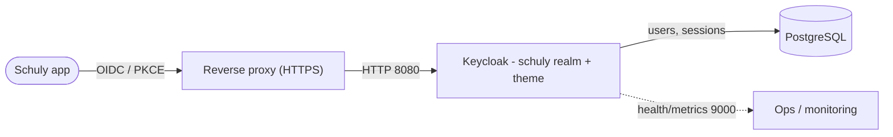

# Architecture

How the pieces fit together, and why the image is built the way it is.

## What's in the image

The repo produces a single self-contained Keycloak image. Three inputs are baked in
at build time so the production container needs nothing but a database:

- **Stage 1** compiles the `keycloakify/` login theme into a Keycloak provider jar.
- **Stage 2** fetches the rockyou leaked-password list.
- **Stage 3** copies the theme jar in and runs `kc.sh build` — an **optimized** build
  pinned to Postgres with health/metrics enabled, so production startup is fast.
- **Stage 4** assembles the runtime image: the optimized server, the blacklist, and
  the `schuly` realm import files.

## Why an optimized build

`kc.sh build` resolves the database vendor and feature flags ahead of time. The
runtime then starts with `start --optimized`, skipping the per-boot build step. The
trade-off: build-time settings (notably `KC_DB`) are fixed in the image — changing
them means rebuilding. Connection details and the hostname stay runtime env vars. See
the [Configuration reference](configuration.md).

## Request / login flow

The Schuly app authenticates against the `schuly` realm over OIDC (the
`schuly-app` public client, PKCE). Keycloak serves the branded login pages, enforces
the 2FA `browser-2fa` flow, and persists users and sessions in Postgres. Health and
metrics are exposed separately on port `9000` for internal monitoring only.

## Source map

See the repository layout table in the [docs index](README.md) for which file owns
what.
