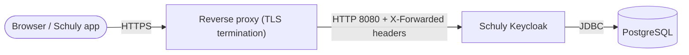

# Self-hosting the full stack

A complete, copy-pasteable guide to running Schuly Keycloak in production: the
database, the Keycloak image, and a TLS-terminating reverse proxy — plus the
first-login admin setup. For the exhaustive list of every setting, see the
[Configuration reference](../configuration.md).

## The stack



You need three things:

1. **PostgreSQL** — Keycloak's datastore (the image is built for Postgres).
2. **The Schuly Keycloak image** — `ghcr.io/schulydev/schulykeycloak:<tag>`.
3. **A reverse proxy** that terminates TLS and forwards to Keycloak on `:8080`
   (Caddy, Traefik, nginx — anything that sets `X-Forwarded-*` headers).

## 1. Pick a hostname and pin a version

- Decide the public URL, e.g. `https://auth.schuly.dev`, and point its DNS at your host.
- Pin an image tag instead of `:latest` so deploys are reproducible — see [Release](release.md)
  for how tags map to versions.

## 2. docker-compose

This runs Postgres + Keycloak + a Caddy reverse proxy (Caddy auto-provisions a
Let's Encrypt certificate and forwards the proxy headers Keycloak needs).

```yaml
services:
  db:
    image: postgres:16
    restart: unless-stopped
    environment:
      POSTGRES_DB: keycloak
      POSTGRES_USER: keycloak
      POSTGRES_PASSWORD: ${DB_PASSWORD:?set DB_PASSWORD}
    volumes:
      - db-data:/var/lib/postgresql/data
    healthcheck:
      test: ["CMD-SHELL", "pg_isready -U keycloak"]
      interval: 10s
      timeout: 5s
      retries: 5

  keycloak:
    image: ghcr.io/schulydev/schulykeycloak:1.4.0   # pin a real tag
    restart: unless-stopped
    depends_on:
      db:
        condition: service_healthy
    environment:
      KC_DB_URL: jdbc:postgresql://db:5432/keycloak
      KC_DB_USERNAME: keycloak
      KC_DB_PASSWORD: ${DB_PASSWORD:?set DB_PASSWORD}
      KC_HOSTNAME: https://auth.schuly.dev
      KC_PROXY_HEADERS: xforwarded
      KC_HTTP_ENABLED: "true"
      # Bootstrap admin — used once, then removed (see step 4).
      KC_BOOTSTRAP_ADMIN_USERNAME: ${BOOTSTRAP_ADMIN_USER:?}
      KC_BOOTSTRAP_ADMIN_PASSWORD: ${BOOTSTRAP_ADMIN_PASSWORD:?}

  proxy:
    image: caddy:2
    restart: unless-stopped
    depends_on: [keycloak]
    ports:
      - "80:80"
      - "443:443"
    volumes:
      - ./Caddyfile:/etc/caddy/Caddyfile
      - caddy-data:/data

volumes:
  db-data:
  caddy-data:
```

`Caddyfile`:

```caddy
auth.schuly.dev {
    reverse_proxy keycloak:8080
}
```

Provide the secrets out of band (e.g. a `.env` file next to the compose, **not**
committed):

```sh
DB_PASSWORD=change-me-long-random
BOOTSTRAP_ADMIN_USER=bootstrap
BOOTSTRAP_ADMIN_PASSWORD=change-me-too
```

Bring it up:

```sh
docker compose up -d
```

> Only `:8080` is proxied. The management port `:9000` (health/metrics) is **not**
> published and must never be exposed to the internet.

## 3. Verify it's healthy

```sh
# from another container on the same network, or exec into the keycloak container
curl -fsS http://keycloak:9000/health/ready
```

Then open `https://auth.schuly.dev/` — you should get the branded Schuly login page,
and the `schuly` realm should exist (it's imported on first start).

## 4. Create a real admin, drop the bootstrap one

The `KC_BOOTSTRAP_ADMIN_*` credentials are a temporary, well-known account. As soon
as the stack is up:

1. Log in to the master realm admin console at `https://auth.schuly.dev/admin/`.
2. Create a new admin user with a strong password (realm **master** → Users).
3. Remove `KC_BOOTSTRAP_ADMIN_USERNAME` / `KC_BOOTSTRAP_ADMIN_PASSWORD` from the
   compose env and `docker compose up -d` again. The bootstrap account only exists
   while those variables are set on first start.

> **Security:** never leave the bootstrap admin credentials in a long-running
> deployment, and never commit real secrets (DB password, admin password) or put
> them in `realms/schuly-realm.json`. Always set `KC_HOSTNAME` to your real HTTPS URL
> and keep TLS terminated at the proxy.

## 5. Upgrades

To move to a newer image, change the pinned tag and `docker compose up -d`. Realm and
user data live in Postgres and persist across image upgrades; an already-imported
realm is left as-is (the bundled realm file only seeds a brand-new database). Back up
the Postgres volume before major Keycloak version jumps.

## Next steps

- [Configuration reference](../configuration.md) — every port, variable, and default.
- [Realm management](../realm-management.md) — edit and snapshot the `schuly` realm.
- [Troubleshooting](../troubleshooting.md) — when something doesn't come up.
